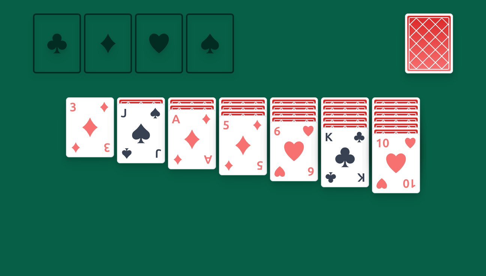

# ⚛️ React solitaire ♠️♥️♣️

A Quick POC project. You can try it [here](https://mscule.github.io/react-solitaire/).

**Works only on PC**

## Specs

This project follows Solitaire rules specified at Bicycles [website](https://bicyclecards.com/how-to-play/solitaire)

## Commands

| Command                   | Description                                     |
| ------------------------- | ----------------------------------------------- |
| `npm run dev`             | Start hot reloading dev server                  |
| `npm run storybook`       | Start storybook dev server                      |
| `npm run build`           | Build the project                               |
| `npm run build-storybook` | Build storybook                                 |
| `npm run preview`         | Build and start preview of the production build |
